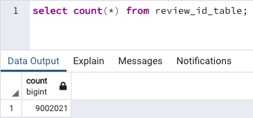

# Amazon_Vine_Analysis

## Analysis Overview
This project analyzes Amazon Vine program and determines if there is a bias toward favorable reviews from Vine members.\
The analysis uses PySpark to perform the ETL process to extract the dataset, transform the data, connect to an AWS RDS instance, load the transformed data into pgAdmin and calculate different metrics.\
We focused on the US reviews for video games.

## Resources
- Data Source: [Amazon Review datasets](https://s3.amazonaws.com/amazon-reviews-pds/tsv/index.txt), [Video Games Review dataset](https://s3.amazonaws.com/amazon-reviews-pds/tsv/amazon_reviews_us_Video_Games_v1_00.tsv.gz)
- Software: Google Colab Notebook, PostgreSQL, pgAdmin 4, AWS

### Resources
* Languages and Packages: PySpark (Apache Spark in Python), Java, Postgres, SQL
* Interfaces: Google Colab Notebook, pgAdmin 4, PostgreSQL, Amazon Web Services (RDS)
* Data Source: [Amazon US Reviews (wireless products)](https://s3.amazonaws.com/amazon-reviews-pds/tsv/amazon_reviews_us_Wireless_v1_00.tsv.gz)

## Results
### Deliverable 1: Perform ETL on Amazon Product Reviews

Extraction of Amazon wireless products reviews on the US site from AWS S3 bucket to PySpark. Creation of tables from the dataframe through transformations. Finally, connect to pgAdmin4 using AWS RDS and load data. 

Customer table             |  Loading into pgAdmin 4
:-------------------------:|:-------------------------:
 |  

---

Product table             |  Loading into pgAdmin 4
:-------------------------:|:-------------------------:
 | 

---

Reviews table             |  Loading into pgAdmin 4
:-------------------------:|:-------------------------:
 | 

---

Vine program table       

### Deliverable 2: Determine Bias of Vine Reviews

Filter vine dataframe to create tables that grab rows with 20 or more votes, 50%+ helpful votes, part of the Vine program (paid), and not part of the Vine program (unpaid), respectively.

### Looking Deeper:

All of the dataframes counted only reviews that had at least 20 or more votes, with 50% or more of those votes marked as helpful. There was a total of 30,765 5* reviews given.

Vine (paid) Reviews:

- 613 paid reviews overall
- 222 5* reviews
- 36.2% of paid reviews were 5* ratings

Non-vine (unpaid) reviews:

- 64,968 unpaid reviews overall
- 30,543 5* reviews
- 47% of unpaid reviews were 5* ratings

## Summary

51% of the reviews in the Vine program were 5 stars reviews whereas the percentage in the non-Vine reviews is only 39%. This describes a positivity bias for reviews in the Vine program.
Additionally we could analyse the statistical distribution (mean, median and mode) of the star rating for the Vine and non-Vine reviews.